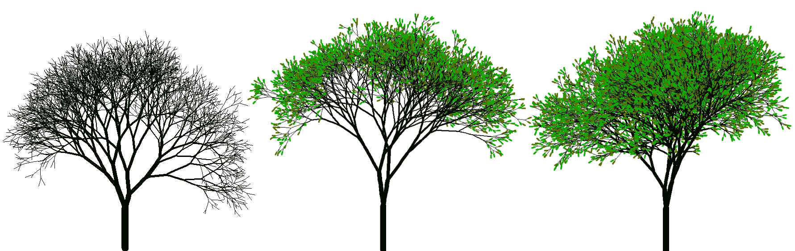

# L-systems.  Создание деревьев.
  
Простой код на **Python** для генерации деревьев, на основе **L-системы**.
Используется библиотека **turtle**.
При каждом запуске получаются разные деревья.
- `notLeafs.py`  - деревья без листьев
- `greenLeafs.py` - деревья с листьями
- `greenLeafsPlus.py` - добавлены дополнительные ветки

Можно поиграть в браузере *( repl.it )*:
- [без листьев](https://repl.it/@foo52ru/notLeafs)
- [с листьями](https://repl.it/@foo52ru/greenLeafs)

Более подробно можно посмотреть в ролике на **YouTube**.

